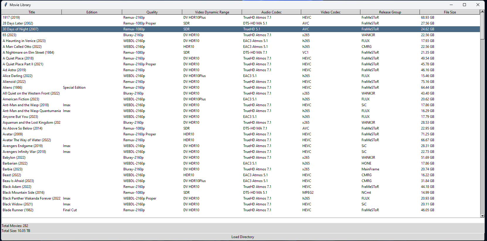

# userscripts

Scripts I find useful

# find_duplicates.sh 

This script will compare defined directorie(s) recursivley to a defined target directorie(s), and either remove or list all duplicate file names.

# Poster tutorial

Tutorial for removing text from posters using stable diffusion

# trash-movie-library-app

GUI application to display your movie library if you are using trash guides naming scheme for files. Features currently include filtering by any column and sorting ascending/descending by title.

