# Poster text removal with Stable Diffusion

Quick tutorial will show you how to easily remove text from any poster

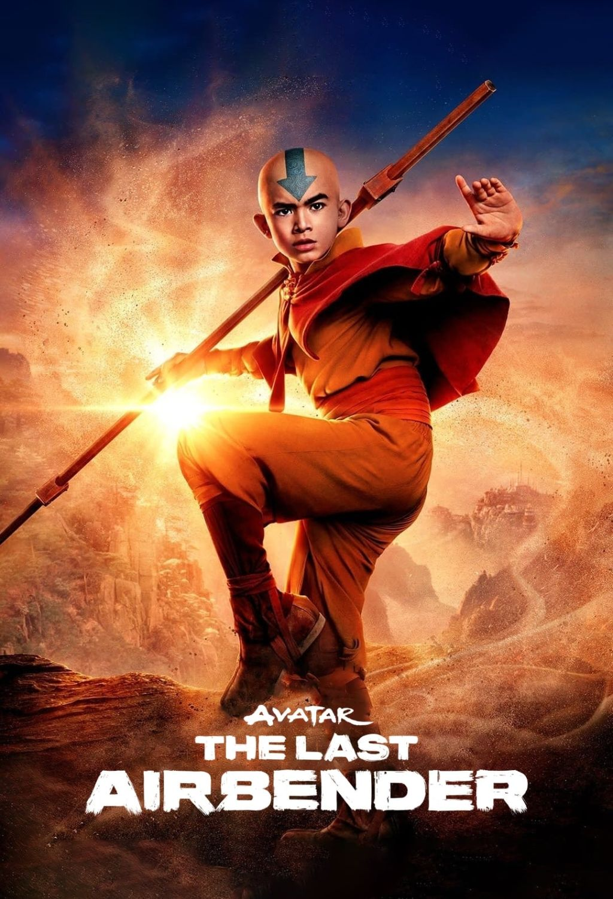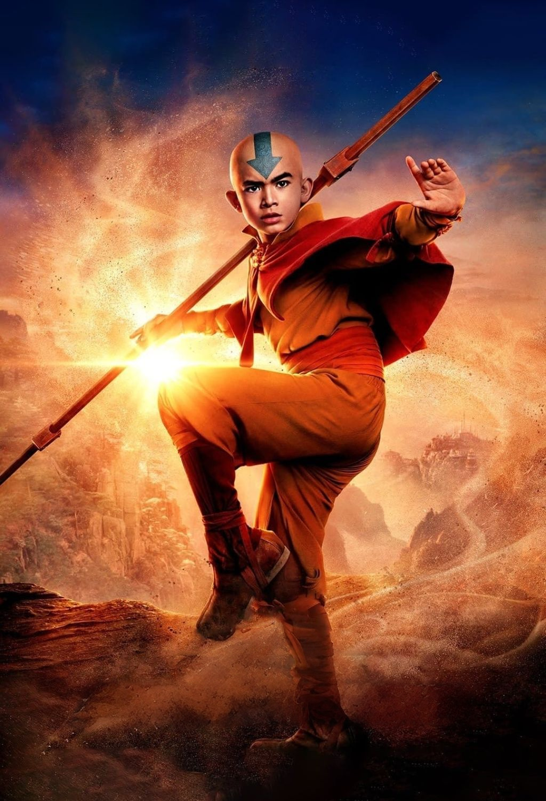

1.  Go to [https://github.com/AUTOMATIC1111](https://github.com/AUTOMATIC1111) and download stable diffusion for whichever operating system you are on.

    > I wont go over installation in this tutorial however you do need a half decent gpu for this method to work

2.  Once you have the webui running you will need a few extensions for this method to help speed up the process and get good results - go to Extensions --> Available, then press the "Load from:" button. 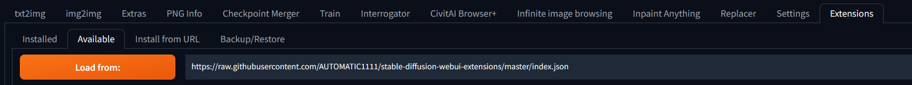 **Install**:\
     `sd-webui-inpaint-anything`\
     `sd-webui-controlnet`

3.  Download an inpainting model, I tested with this one\
    [https://civitai.com/models/132632?modelVersionId=201346](https://civitai.com/models/132632?modelVersionId=201346)\
    Place in `stable-diffusion-webui/models/Stable-diffusion`

4.  Finally download controlnet inpainting model\
     [https://huggingface.co/lllyasviel/ControlNet-v1-1/blob/main/control_v11p_sd15_inpaint.pth](https://huggingface.co/lllyasviel/ControlNet-v1-1/blob/main/control_v11p_sd15_inpaint.pth)\
     [https://huggingface.co/lllyasviel/ControlNet-v1-1/blob/main/control_v11p_sd15_inpaint.yaml](https://huggingface.co/lllyasviel/ControlNet-v1-1/blob/main/control_v11p_sd15_inpaint.yaml)\
    Place in `stable-diffusion-webui/models/ControlNet`

    > Make sure you reload the webui after installing the extensions and models

5.  You should now have a tab that says: **Inpaint Anything**, go there and load the poster as the input image.
    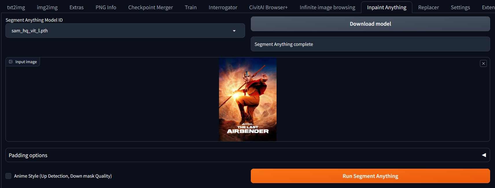
    >I recommend resizing the poster to 1000x1500 before doing any of this you can use this website:
    >[https://www.birme.net/?target_width=1000&target_height=1500](images/https://www.birme.net/?target_width=1000&target_height=1500)
    >
    Pick one of the hq models, press download model and press `Run Segment Anything`
6.  You should now end up with this
    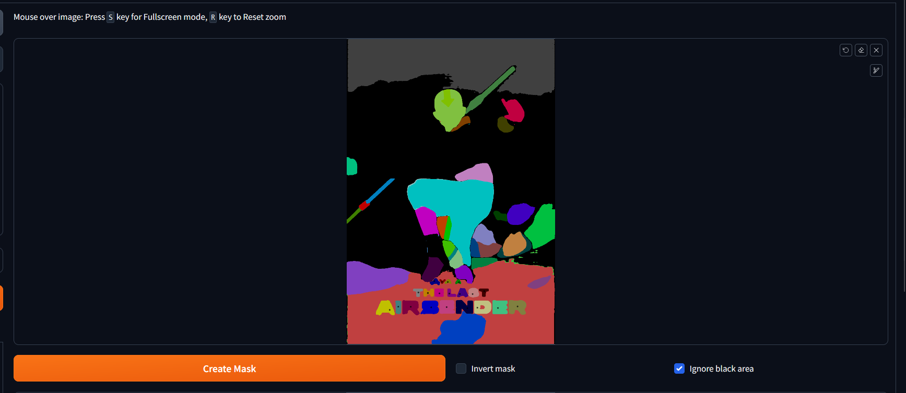

    Use the brush to put one dot on every place you want removed, they will all be different colors, then press `Create Mask`

    It is not always perfect so if it missed somewhere you can edit the mask by using these options
    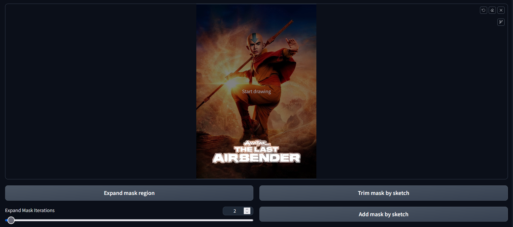

    > I recommend using the Expand mask region by a bit so it goes slightly outside of the text you want removed.

7.  Finally, to the left press `get mask` 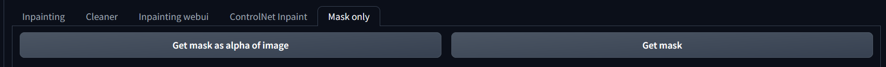 and `send to img2img inpaint` 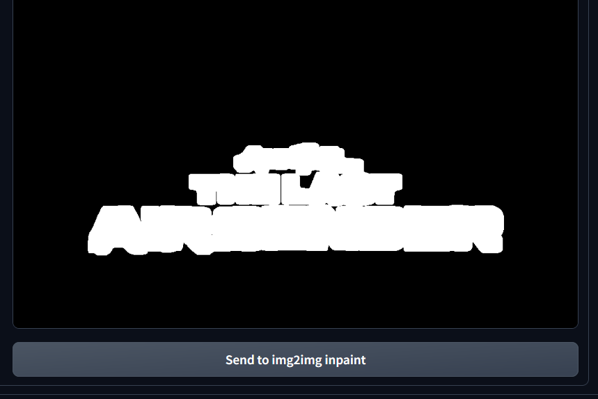
8.  Here are what options you will want to use 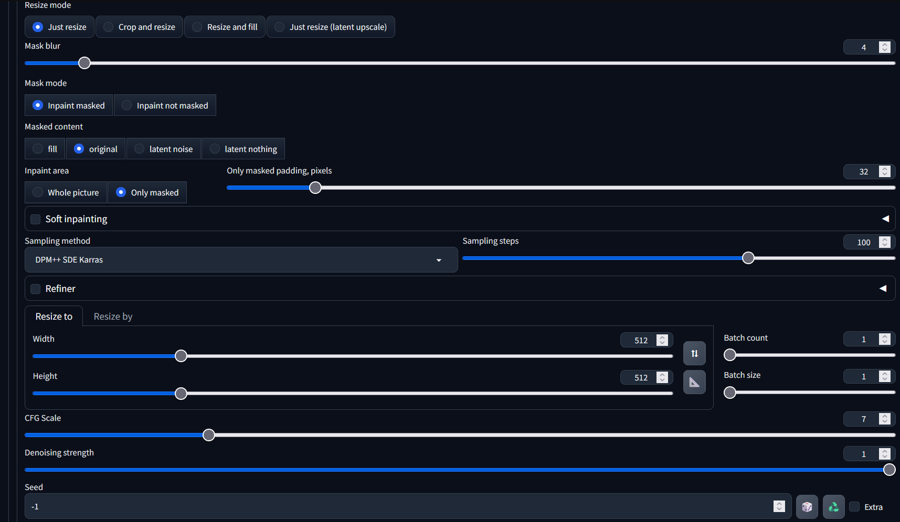

    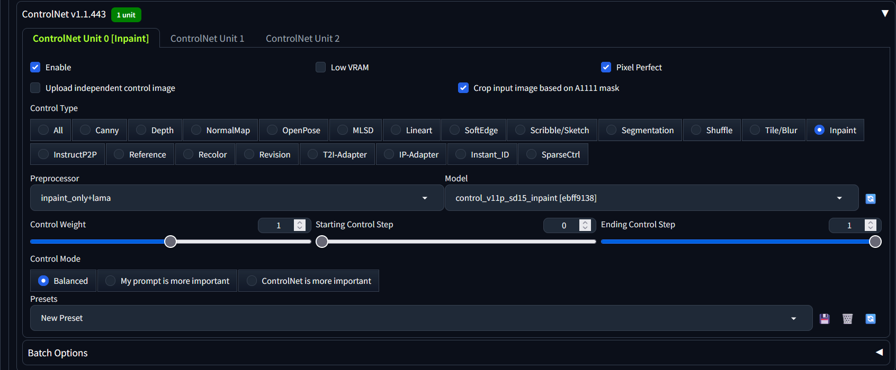

    > You can play around with the sampling steps or sampling method to acheive different results.
    >
9. Leave the prompt blank and hit generate and watch the magic happen!

## Final Note

Its not always perfect some posters are tricker then others. For this one I had to lower the control weight to 0.7 in controlnet settings and expand the mask so the AI had more information to generate a better image. You can play around with it and see if you can get it to do even better. Also different models might be better for different images so you can try out a few. Here is another example for a tougher image to remove the text from

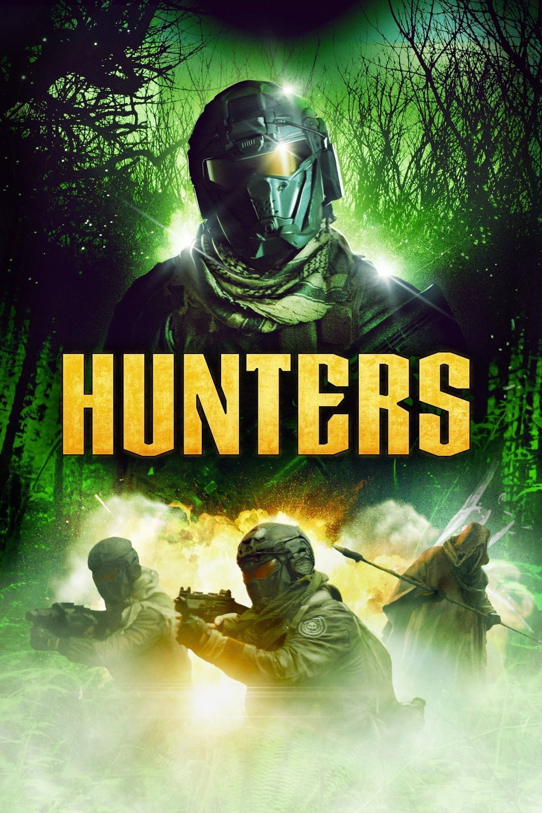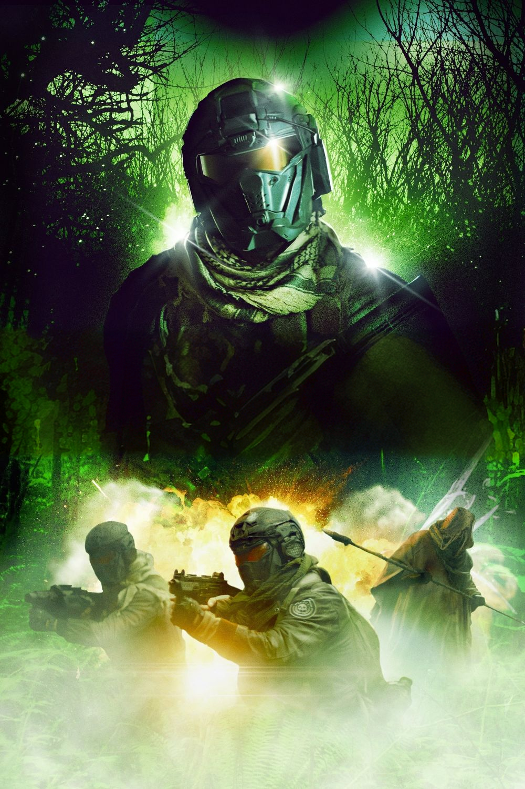\
Here is the mask I used 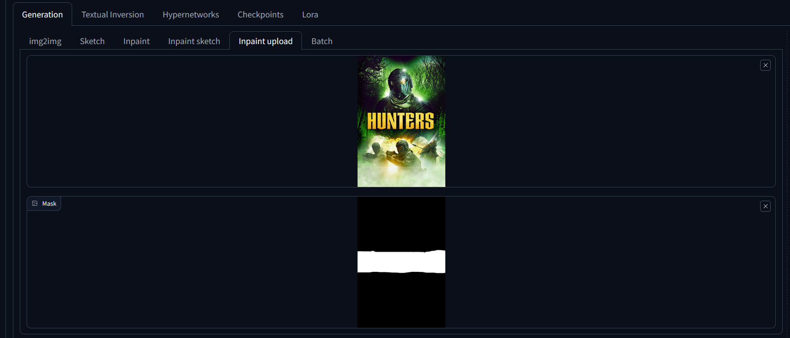

You can see the colors are off but with enough playing around im sure you could get something near perfect. Anyways thats all thanks for reading!
